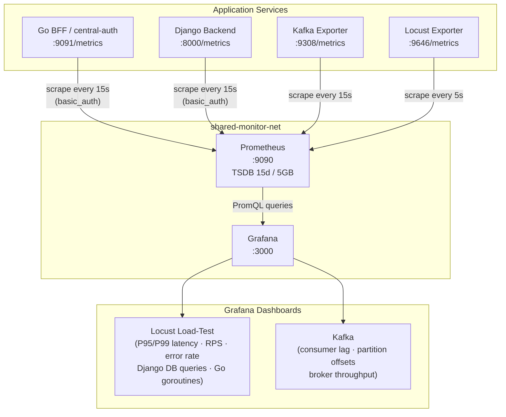
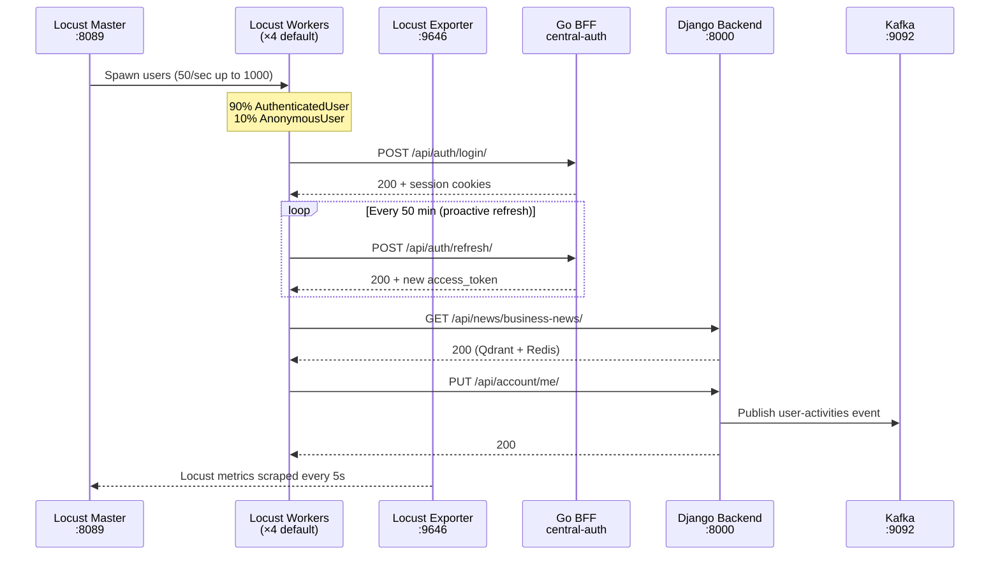
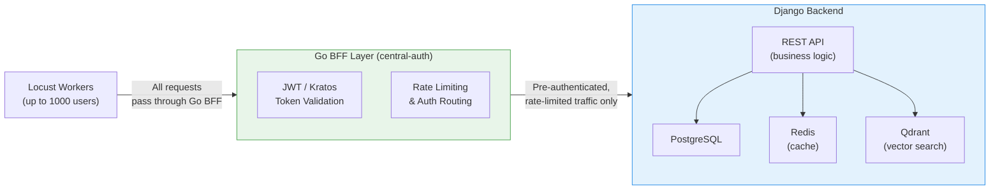

# Hackonomics Infrastructure — Monitoring & Load Testing

End-to-end observability and load-testing reference for the Hackonomics 2026 stack.

---

## Table of Contents

1. [Stack Overview](#1-stack-overview)
2. [Scrape Configurations](#2-scrape-configurations)
3. [Dashboard Highlights](#3-dashboard-highlights)
4. [Load Testing Guide](#4-load-testing-guide)
5. [Service Boundaries & Go BFF Shield Pattern](#5-service-boundaries-and-go-bff-shield-pattern)
6. [Scaling Procedures](#6-scaling-procedures)
7. [Troubleshooting Reference](#7-troubleshooting-reference)

---

## 1. Stack Overview

| Component | Image | Port | Network | Purpose |
|-----------|-------|------|---------|---------|
| **Prometheus** | `prom/prometheus:v3.2.1` | 9090 | shared-monitor-net | Metrics scraping & TSDB (15d / 5GB) |
| **Grafana** | `grafana/grafana:11.5.2` | 3000 | shared-monitor-net | Dashboard visualisation |
| **Kafka** | `confluentinc/cp-kafka:7.9.0` | 19092 | shared-monitor-net | Event streaming (KRaft, no ZooKeeper) |
| **Kafka Exporter** | `danielqsj/kafka-exporter:v1.8.0` | 9308 | shared-monitor-net | Kafka → Prometheus bridge |
| **Kafka UI** | `provectuslabs/kafka-ui:v0.7.2` | 8080 | shared-monitor-net | Broker inspection web UI |
| **Locust Master** | Custom (`loadtest/Dockerfile`) | 8089, 5557 | locust-net + shared-monitor-net | Load test controller & web UI |
| **Locust Worker** | Custom (`loadtest/Dockerfile`) | — | locust-net + shared-monitor-net | Test execution (×4 default) |
| **Locust Exporter** | `containersol/locust_exporter` | 9646 | locust-net + shared-monitor-net | Locust → Prometheus bridge |

### Telemetry Data Flow



### Prerequisites

```bash
# Create the shared overlay network before starting either stack
docker network create shared-monitor-net
```

Both `docker-compose.yml` (main stack) and `docker-compose.locust.yml` (load test stack) attach to this external network. Starting either stack without it will fail immediately.

---

## 2. Scrape Configurations

Prometheus config is generated at startup from a template to avoid committing credentials:

```
monitoring/prometheus.yml.tmpl   ← source of truth (commit this)
monitoring/prometheus.yml        ← generated at runtime   (git-ignored)
```

The `prometheus-config-init` container runs `envsubst` on the template and writes the result to a shared Docker volume before Prometheus starts.

### Required Environment Variables

| Variable | Used In | Description |
|----------|---------|-------------|
| `METRICS_BASIC_AUTH_USER` | central-auth, django jobs | Username for `/metrics` endpoints |
| `METRICS_BASIC_AUTH_PASSWORD` | central-auth, django jobs | Password for `/metrics` endpoints |
| `GF_ADMIN_USER` | Grafana | Admin login username |
| `GF_ADMIN_PASSWORD` | Grafana | Admin login password |

> **Warning:** `monitoring/prometheus.yml` is git-ignored because it contains plaintext credentials generated from the template. Never commit this file. Always use the `.tmpl` source.

### Scrape Jobs

| Job | Target | Interval | Auth | Notes |
|-----|--------|----------|------|-------|
| `prometheus` | `localhost:9090` | 15s | None | Self-monitoring |
| `central-auth` | `auth-server:9091` | 15s | Basic auth | Go BFF metrics (goroutines, GC, heap, HTTP handler latency) |
| `django` | `myeconocoach-web:8000` | 15s | Basic auth | Django-prometheus metrics (view latency, DB queries, response codes) |
| `kafka-exporter` | `kafka-exporter:9308` | 15s | None | Broker throughput, consumer lag, partition health |
| `locust` | `locust-exporter:9646` | 5s | None | Real-time load test metrics (faster interval for live monitoring) |

The `prometheus-locust.yml` file in this directory is an optional snippet that can be appended to the main Prometheus config when running the load test stack standalone:

```bash
cat monitoring/prometheus-locust.yml >> /path/to/prometheus.yml
```

---

## 3. Dashboard Highlights

All dashboards are provisioned automatically from `monitoring/grafana/dashboards/`. Grafana reads them on startup — no manual import required.

### Locust Load-Test Dashboard

**Overview row**

| Panel | Query | What it shows |
|-------|-------|---------------|
| Active Users | `locust_users` | Simulated user count in real time |
| Requests Per Second | `sum(rate(locust_requests_num_requests[1m]))` | System throughput |
| Error Rate (%) | `sum(rate(locust_requests_num_failures[1m])) / sum(rate(locust_requests_num_requests[1m])) * 100` | Failure ratio |
| Response Time P95 / P99 | `locust_requests_response_time_pct_95` | Client-perceived latency |

**Django row**

| Panel | Query | What it shows |
|-------|-------|---------------|
| HTTP Latency P95 by View | `histogram_quantile(0.95, sum(rate(django_http_requests_latency_seconds_by_view_method_bucket[1m])) by (le, view))` | Slowest endpoints |
| HTTP Responses by Status | `sum(rate(django_http_responses_total_by_status_total[1m])) by (status)` | 2xx / 4xx / 5xx breakdown |
| DB Query Rate | `rate(django_db_execute_total[1m])` | ORM throughput |
| DB Query Duration P95 | `histogram_quantile(0.95, sum(rate(django_db_query_duration_seconds_bucket[1m])) by (le, alias))` | Slow query detection |

**Go BFF row**

| Panel | Query | What it shows |
|-------|-------|---------------|
| Goroutine Count | `go_goroutines{job="central-auth"}` | Concurrency health |
| Heap Memory | `go_memstats_heap_alloc_bytes{job="central-auth"}` | Memory usage |
| GC Duration | `rate(go_gc_duration_seconds_sum{job="central-auth"}[1m])` | GC pressure |
| Handler Latency P95 | `histogram_quantile(0.95, sum(rate(central_auth_http_request_duration_seconds_bucket[10m])) by (le, handler))` | Auth endpoint latency |
| DB Connection Pool | `go_pgx_pool_connections_in_use{db_name="central_auth"}` | Pool saturation |

### Kafka Dashboard

| Panel | Query | What it shows |
|-------|-------|---------------|
| Write Rate by Topic | `sum by (topic) (rate(kafka_topic_partition_current_offset[1m]))` | Messages/sec per topic |
| Consumer Group Lag | `sum by (consumergroup, topic) (kafka_consumergroup_lag)` | Processing backlog |
| Max Lag per Group | `max by (consumergroup) (kafka_consumergroup_lag)` | Worst-case lag |
| Under-replicated Partitions | `sum(kafka_topic_partition_under_replicated_partition)` | Replication health (0 = healthy) |
| Messages Retained | `kafka_topic_partition_current_offset - kafka_topic_partition_oldest_offset` | Data depth per partition |

---

## 4. Load Testing Guide

### Quick Start

```bash
# 1. Ensure shared network exists
docker network create shared-monitor-net

# 2. Start the monitoring stack (if not already running)
docker-compose up -d

# 3. Seed test users into Kratos (one-time, idempotent)
docker-compose -p hackonomics-locust -f docker-compose.locust.yml \
  run --rm locust-master \
  locust --headless --class-picker --users 1000 --spawn-rate 50 \
         --run-time 5m --only-summary

# 4. Run the main load test (web UI mode)
LOCUST_HOST=http://host.docker.internal:8000 \
LOCUST_WORKERS=4 \
docker-compose -p hackonomics-locust -f docker-compose.locust.yml up

# Open: http://localhost:8089
```

### Environment Variables

| Variable | Default | Description |
|----------|---------|-------------|
| `LOCUST_HOST` | `http://host.docker.internal:8000` | Target base URL |
| `LOCUST_USERS` | `1000` | Maximum simulated users |
| `LOCUST_SPAWN_RATE` | `50` | Users added per second during ramp-up |
| `LOCUST_RUN_TIME` | `10m` | Headless test duration |
| `LOCUST_WORKERS` | `4` | Worker container replicas |
| `MAX_SIGNUPS` | `500` | Global cap on anonymous signups per run |

### User Personas

| Class | Weight | Wait Time | Purpose |
|-------|--------|-----------|---------|
| `AuthenticatedUser` | 9 (≈90%) | 3–15 s | Logged-in browsing + writes |
| `AnonymousUser` | 1 (≈10%) | 10–30 s | Fresh signup flow |
| `KratosSeeder` | — | 0 s | Utility: bulk identity pre-registration |

`KratosSeeder` is excluded from normal runs. Select it explicitly via the web UI class picker or `--class-picker` flag when seeding.

### Task Distribution (AuthenticatedUser — 27 points)

| Task | Weight | Endpoint | Notes |
|------|--------|----------|-------|
| `browse_business_news` | 5 | `GET /api/news/business-news/` | Qdrant vector search + Redis cache |
| `check_exchange_rate` | 4 | `GET /api/exchange/usd-to/{currency}/` | 15 currencies; requires Redis cache |
| `browse_countries` | 3 | `GET /api/meta/countries/` | REST Countries proxy; TTL ~24h |
| `view_account` | 3 | `GET /api/account/me/` | User profile |
| `view_calendar` | 2 | `GET /api/calendar/me/` | Calendar object |
| `list_calendar_events` | 2 | `GET /api/calendar/events/` | Event list |
| `view_exchange_history` | 2 | `GET /api/exchange/history/` | PostgreSQL-backed history |
| `view_my_exchange_rate` | 2 | `GET /api/account/me/exchange-rate/` | Preferred exchange rate |
| `verify_session` | 1 | `GET /api/auth/me/` | Session health check |
| `update_profile` | 1 | `PUT /api/account/me/` | Triggers Kafka outbox event |
| `run_simulation` | 1 | `POST /api/simulation/compare/dca-vs-deposit/` | Compute-heavy DCA calculation |
| `add_calendar_event` | 1 | `POST /api/calendar/events/create/` | DB write |

### Load Test Sequence



### Credential Pool

Authenticated users draw credentials from `loadtest/data/test_users.json` (1000 entries). The pool is thread-safe (FIFO queue, 30s acquire timeout).

To seed a fresh environment:

```bash
# Seed via KratosSeeder persona
docker-compose -p hackonomics-locust -f docker-compose.locust.yml \
  run --rm locust-master \
  locust --headless --class-picker --users 1000 --spawn-rate 50 \
         --run-time 5m --only-summary

# Or run the standalone script
python3 loadtest/scripts/seed_users.py
```

Re-runs are safe — `409 Conflict` (duplicate email) is treated as success.

---

## 5. Service Boundaries and Go BFF Shield Pattern



### The 150-User Bottleneck

Early load tests at ~150 concurrent authenticated users revealed a saturation point in Django's WSGI worker pool. Symptoms:

- Response time P95 climbed from ~80ms to >2s
- `django_db_execute_total` rate spiked disproportionately
- PostgreSQL connection pool exhausted (`go_pgx_pool_connections_in_use` near max)

**Root cause:** Django's `TokenAuthentication` middleware was performing a DB lookup on every request to validate session tokens.

**Resolution:** Token validation was moved entirely into the Go BFF (`central-auth`), which validates JWTs in-process with no DB round-trip. Django now only receives pre-authenticated, rate-limited traffic. The saturation point moved beyond 500 concurrent users in subsequent runs.

**What this means for load testing:**
- All auth endpoints (`/api/auth/*`) hit Go BFF, not Django
- Token refresh cycles (every 50 min) are absorbed by Go BFF
- The `verify_session` task (`GET /api/auth/me/`) measures Go BFF latency, not Django's

---

## 6. Scaling Procedures

### Horizontal: Add Locust Workers

```bash
# Scale workers without restarting the master
docker-compose -p hackonomics-locust -f docker-compose.locust.yml \
  up --scale locust-worker=8 -d
```

**Credential pool constraint:** With `N` workers, each worker process gets a copy of `test_users.json`. Ensure your target user count does not exceed `len(test_users) * N`. The default pool has 1000 entries; with 4 workers the effective pool is 4000 credential slots.

### Vertical: Tune Spawn Rate & Users

```bash
# Gradual ramp — safer for production-adjacent environments
LOCUST_USERS=500 LOCUST_SPAWN_RATE=10 \
docker-compose -p hackonomics-locust -f docker-compose.locust.yml up

# Stress test — maximum throughput
LOCUST_USERS=1000 LOCUST_SPAWN_RATE=100 LOCUST_WORKERS=8 \
docker-compose -p hackonomics-locust -f docker-compose.locust.yml up
```

### Prometheus Retention Tuning

Defaults (`docker-compose.yml` at repo root):

```yaml
--storage.tsdb.retention.time=15d
--storage.tsdb.retention.size=5GB
```

Adjust via `PROMETHEUS_RETENTION_TIME` and `PROMETHEUS_RETENTION_SIZE` environment variables if disk pressure occurs during long test campaigns.

### Kafka Topic Partitions

Default topics (`access-logs`, `user-activities`) are created with 3 partitions. To increase throughput headroom:

```bash
docker exec -it hackonomics-kafka \
  kafka-topics --bootstrap-server kafka:9092 \
  --alter --topic user-activities --partitions 6
```

Monitor `kafka_consumergroup_lag` in Grafana after scaling — lag should drain within one scrape interval under normal conditions.

---

## 7. Troubleshooting Reference

### Locust workers cannot connect to master

**Symptom:** Workers log `Connection refused` to `locust-master:5557`.

**Fix:** Ensure the master is fully started before workers. The `depends_on` in `docker-compose.locust.yml` handles this under normal conditions; if it fails, restart workers:

```bash
docker-compose -p hackonomics-locust -f docker-compose.locust.yml restart locust-worker
```

### Prometheus shows `locust-exporter` target as DOWN

**Symptom:** Locust Exporter target shows `DOWN` in `http://localhost:9090/targets`.

**Fix:** Verify `shared-monitor-net` exists and both the locust stack and monitoring stack are attached:

```bash
docker network inspect shared-monitor-net | grep Name
```

Also confirm `prometheus-locust.yml` `targets` is a valid YAML list: `["locust-exporter:9646"]` — a bare string will silently fail.

### All 1000 seeded logins fail with 401

**Symptom:** `AuthenticatedUser` immediately raises `StopUser`; error count spikes.

**Likely cause:** Credential mismatch — `test_users.json` may contain the old password (`LoadTest1!`) while the application now enforces a stronger policy.

**Fix:** Re-seed users using `KratosSeeder` with the current password, or update `test_users.json`:

```bash
python3 loadtest/scripts/seed_users.py
```

### Django DB query rate spike under load

**Symptom:** `django_db_execute_total` rate spikes non-linearly beyond 200 users.

**Expected baseline:** ~3–5 DB queries per `update_profile` task (outbox write + account update). Non-linear growth suggests N+1 query regression.

**Investigation:** Check `django_db_query_duration_seconds` by `alias` in the Locust dashboard — the slow alias identifies the ORM call site.

### Kafka consumer lag not draining

**Symptom:** `kafka_consumergroup_lag` grows continuously and does not decrease.

**Fix checklist:**
1. Confirm the Django consumer is running (`docker ps`)
2. Check `KAFKA_AUTO_OFFSET_RESET` is set to `earliest` for new consumer groups
3. Scale partitions if a single consumer thread is the bottleneck (see Scaling section)

### Grafana dashboards show "No Data"

**Symptom:** All panels display "No Data" after stack startup.

**Likely cause:** Prometheus datasource UID mismatch. Provisioning expects `uid: prometheus`.

**Fix:** In Grafana → Connections → Data Sources, verify the Prometheus datasource UID matches. If provisioning created a duplicate, delete the extra entry and reload dashboards.
